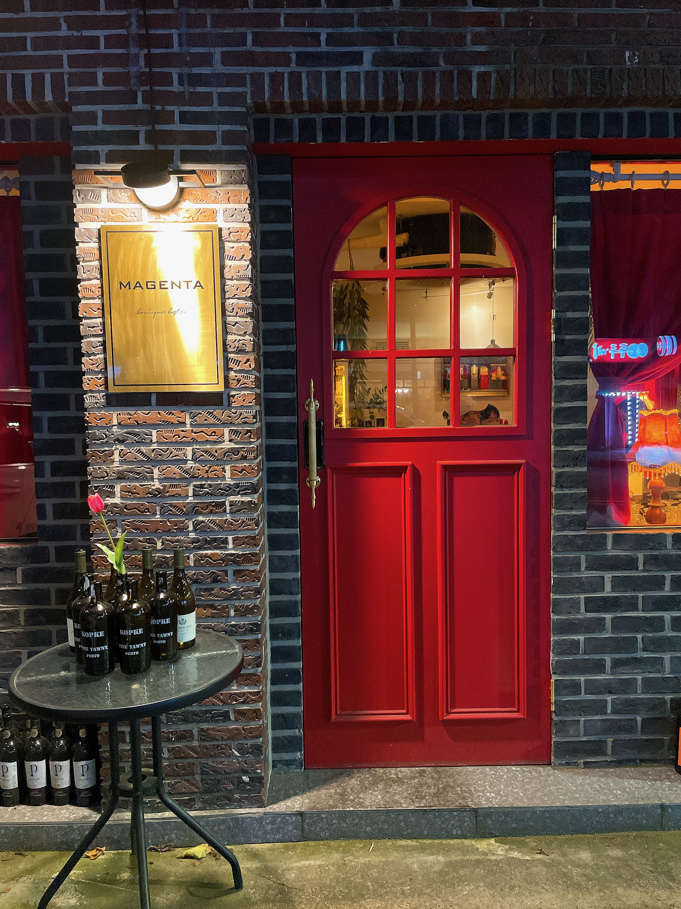
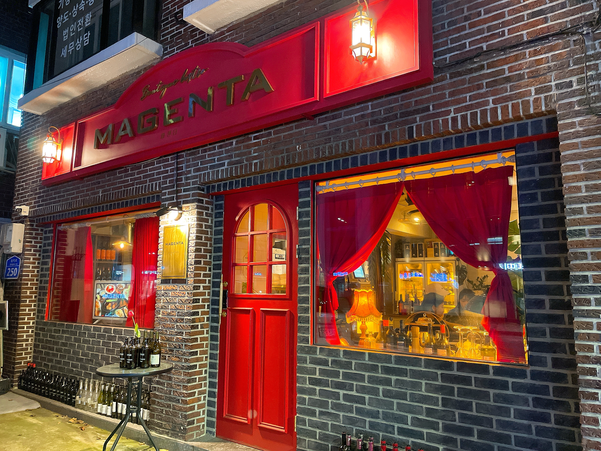
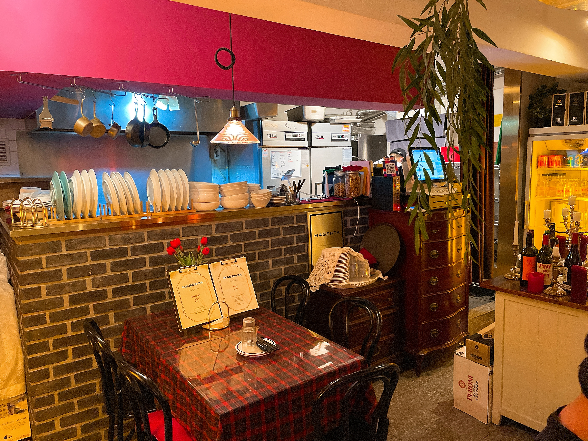
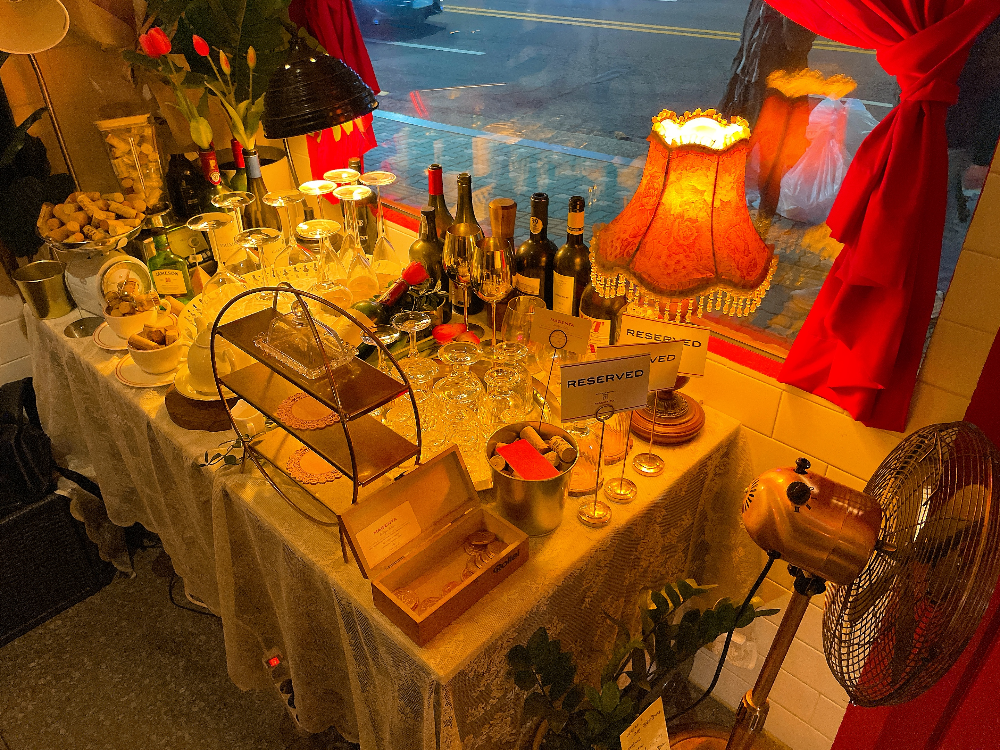
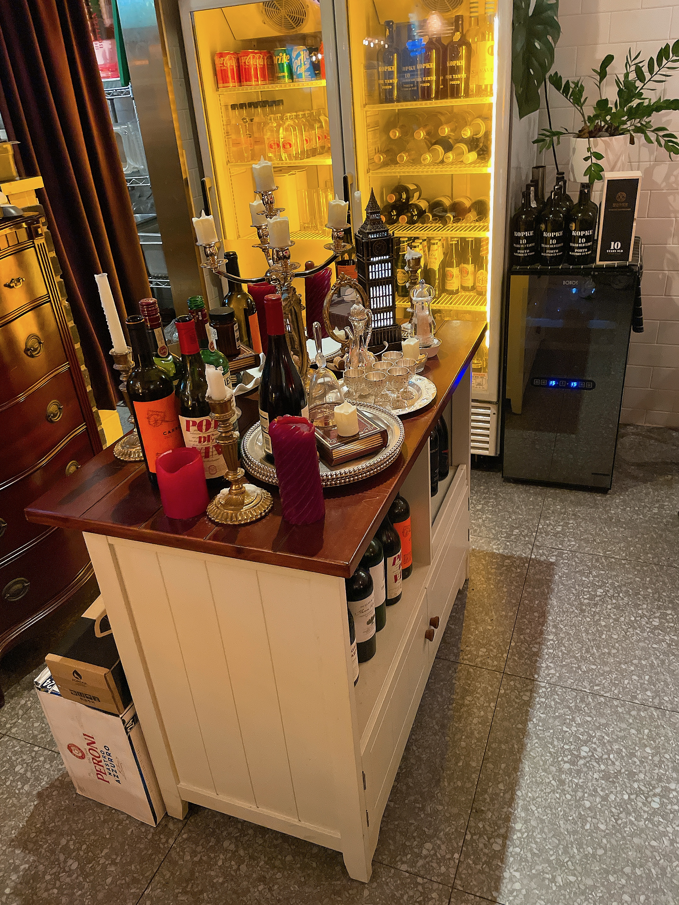
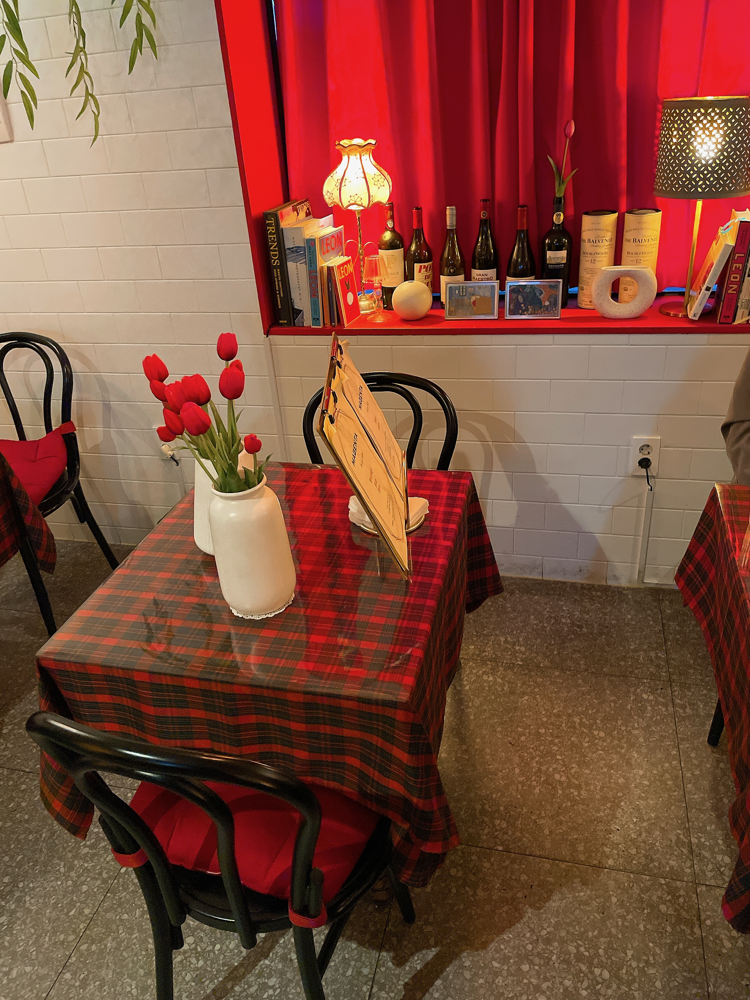
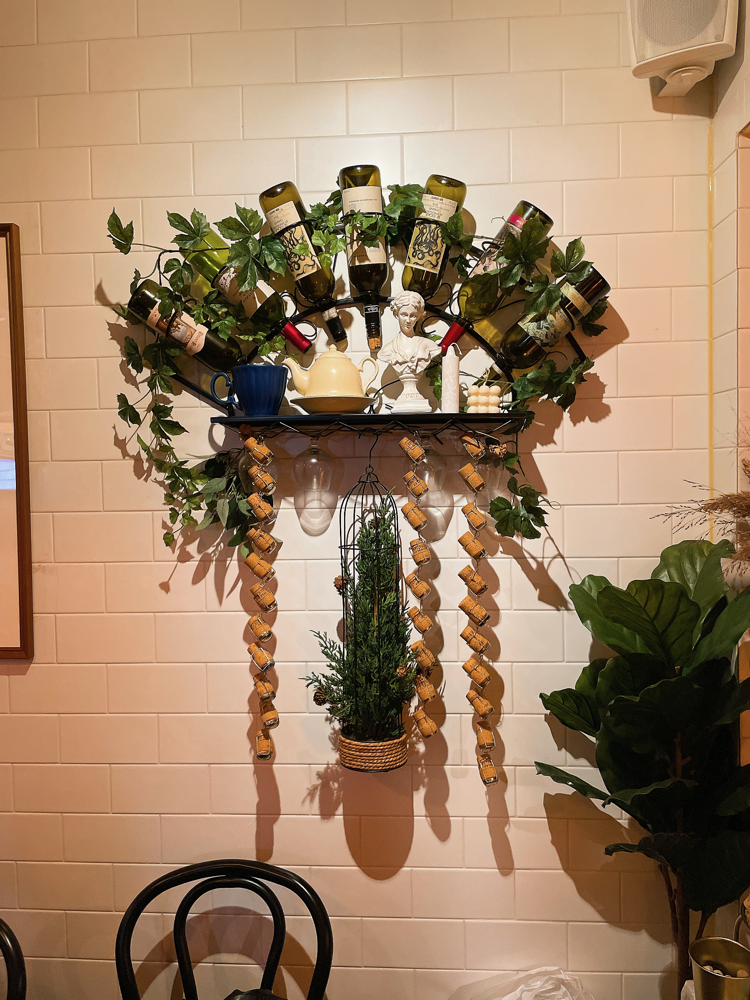
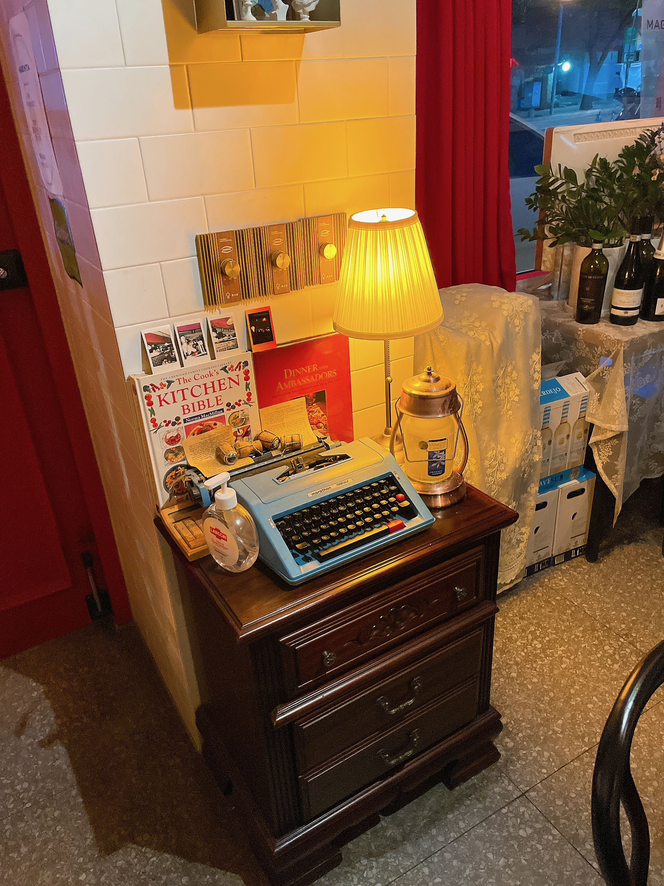

# 대흥역 양식집 마젠타(MAGENTA)

>ℹ️ info
> 
> 저녁에는 음료 한잔을 무조건 시켜야한다.

평점 : 3.0/5.0

 

<a target="_blank" href="https://map.kakao.com/?from=roughmap&amp;srcid=868642967&amp;confirmid=868642967&amp;q=%EB%A7%88%EC%A0%A0%ED%83%80&amp;rv=on" style="float:left;height:15px;padding-top:1px;line-height:15px;color:#000;text-decoration: none;">로드뷰</a><a target="_blank" href="https://map.kakao.com/?from=roughmap&amp;eName=%EB%A7%88%EC%A0%A0%ED%83%80&amp;eX=487013.0&amp;eY=1124118.0" style="float:left;height:15px;padding-top:1px;line-height:15px;color:#000;text-decoration: none;">길찾기</a><a target="_blank" href="https://map.kakao.com?map_type=TYPE_MAP&amp;from=roughmap&amp;srcid=868642967&amp;itemId=868642967&amp;q=%EB%A7%88%EC%A0%A0%ED%83%80&amp;urlX=487013.0&amp;urlY=1124118.0" style="float:left;height:15px;padding-top:1px;line-height:15px;color:#000;text-decoration: none;">지도 크게 보기</a>

